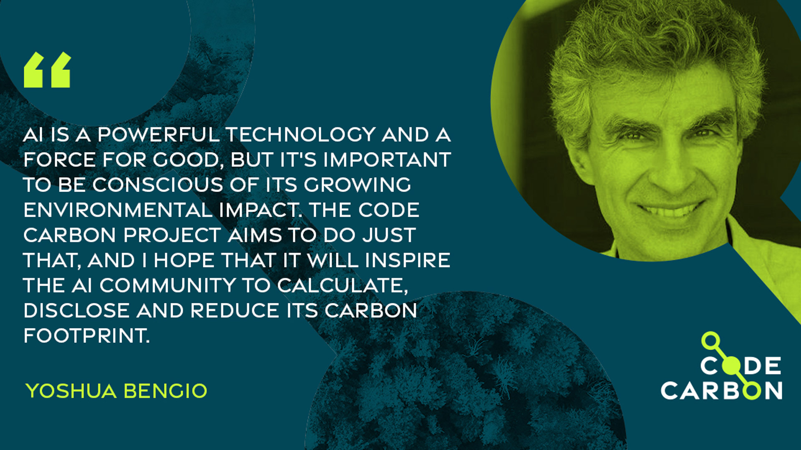

# Learning When to Stop: Budget-Aware Early Exiting for Energy-Efficient CNN Inference

**Student:** Tran Anh Chuong  
**University:** VinUniversity  
**Course:** COMP2050 - AI Programming Project  
**Target Deadline:** July 12, 2026  

---

## 1. Project Overview

Modern Convolutional Neural Networks (CNNs) usually perform the same full forward pass for every input, even though some images are much easier to classify than others. This wastes computation, increases inference latency, and contributes to unnecessary energy usage.

This project explores a **Green AI** approach using **budget-aware dynamic early exiting**. Instead of forcing every CIFAR-10 image to pass through the full ResNet-18 model, the network is modified with intermediate classifiers, called **early exits**, placed after selected ResNet stages. If an intermediate classifier is sufficiently reliable, the model stops early and returns the prediction. If not, the image continues to deeper layers.

The central idea is:

> The model should spend more computation only when the input is difficult enough to justify it.

This project is therefore not standard static pruning. It does not permanently remove weights or filters from the model. Instead, it performs **input-dependent inference**, where each image may use a different amount of computation.

---

## 2. Research Question

The main research question is:

> **Can a CNN learn when to stop computation in order to reduce FLOPs, latency, and carbon emissions while maintaining acceptable classification accuracy?**

To answer this, the project compares three exit-decision strategies:

1. **Fixed confidence thresholding**  
   Exit when the current classifier's confidence is above a fixed threshold.

2. **Budget-aware dynamic thresholding**  
   Adjust the exit threshold based on how much computation has already been used.

3. **Learned exit controller**  
   Train a small controller to decide whether to exit or continue using confidence, entropy, margin, exit index, and FLOPs-used features.

---

## 3. Base Algorithm and Environment

- **Backbone model:** ResNet-18
- **Task:** Image classification
- **Dataset:** CIFAR-10
- **Framework:** PyTorch
- **Efficiency tracking:** FLOPs (Floating Point Operations), latency, and CodeCarbon emissions
- **Main comparison:** Full ResNet-18 vs early-exit ResNet-18 variants

---

## 4. Proposed Model: Early-Exit ResNet-18

The modified architecture adds auxiliary classifiers after intermediate ResNet stages:

```text
Input image
→ ResNet stem
→ Layer 1 → Exit 1
→ Layer 2 → Exit 2
→ Layer 3 → Exit 3
→ Layer 4 → Final exit
```

Each exit produces a class prediction and a confidence score. For exit `i`, the output probability is:

```math
p_i = softmax(z_i)
```

The confidence score is:

```math
c_i = \max_j p_i(j)
```

The goal is not to exit at the shallowest layer for every image. The goal is to find the **earliest reliable exit** for each input.

---

## 5. Training Objective

All exits are trained jointly using weighted cross-entropy loss:

```math
L = \alpha_1 L_1 + \alpha_2 L_2 + \alpha_3 L_3 + \alpha_4 L_4
```

A planned initial weighting scheme is:

```math
\alpha_1 = 0.3, \quad \alpha_2 = 0.5, \quad \alpha_3 = 0.7, \quad \alpha_4 = 1.0
```

The final classifier receives the largest weight to preserve the full model's accuracy while still allowing earlier exits to learn useful predictions.

---

## 6. Exit-Decision Strategies

### 6.1 Strategy 1: Fixed Confidence Thresholding

The simplest strategy exits when the maximum softmax confidence exceeds a fixed threshold:

```math
\text{exit at } i \text{ if } c_i \geq \tau
```

Planned threshold sweep:

```text
τ = 0.60, 0.70, 0.80, 0.90, 0.95
```

Expected behavior:

- Lower threshold → more early exits, lower FLOPs, possible accuracy drop.
- Higher threshold → fewer early exits, higher accuracy, less compute saving.

### 6.2 Strategy 2: Budget-Aware Dynamic Thresholding

Instead of using one fixed threshold, the threshold changes based on the computation already used.

Let:

```math
r_i = \frac{\text{FLOPs used up to exit } i}{\text{FLOPs of full ResNet-18}}
```

Two variants will be tested.

**Accuracy-first thresholding:**

```math
\tau_i = \tau_0 + \alpha r_i
```

This becomes stricter as more computation is used.

**Budget-first thresholding:**

```math
\tau_i = \tau_0 - \alpha r_i
```

This becomes more willing to exit as the model approaches the full computation budget. This variant is especially aligned with the Green AI goal.

### 6.3 Strategy 3: Learned Exit Controller

The learned controller treats early exiting as a small decision-making problem. At each exit, it decides:

```math
a_i \in \{\text{exit}, \text{continue}\}
```

The controller receives the feature vector:

```math
s_i = [c_i, H_i, m_i, i, r_i]
```

where:

- `c_i`: maximum softmax confidence
- `H_i`: entropy of the prediction
- `m_i`: margin between top-1 and top-2 probabilities
- `i`: current exit index
- `r_i`: fraction of FLOPs already used

Entropy is:

```math
H_i = -\sum_j p_i(j) \log p_i(j)
```

Margin is:

```math
m_i = p_i(\text{top-1}) - p_i(\text{top-2})
```

The reward idea is:

```math
R = \mathbb{1}[\hat{y}=y] - \lambda \cdot \frac{\text{FLOPs}_i}{\text{FLOPs}_{full}}
```

This rewards correct predictions while penalizing expensive computation. In practice, the first implementation may train the controller using the **earliest correct exit** as a supervised target, then compare it with the reward-based version if time allows.

---

## 7. Evaluation Plan

The project will compare the full ResNet-18 baseline against the three early-exit strategies.

### 7.1 Main Metrics

- **Test accuracy (%):** Measures classification performance.
- **Average FLOPs/sample:** Measures computational cost.
- **FLOPs reduction (%):** Measures computation saved compared with full ResNet-18.
- **Inference latency (ms):** Measures real runtime speedup.
- **Carbon emissions (gCO₂eq):** Estimated using the `codecarbon` Python library.
- **Exit distribution:** Shows the percentage of samples exiting at Exit 1, Exit 2, Exit 3, and the final exit.

FLOPs reduction is computed as:

```math
\text{FLOPs Reduction} = 1 - \frac{\text{Average FLOPs}_{method}}{\text{FLOPs}_{full}}
```

### 7.2 Planned Result Tables

**Baseline table:**

| Model | Accuracy | FLOPs/sample | Latency/sample | CO₂ Emissions |
| :--- | ---: | ---: | ---: | ---: |
| Full ResNet-18 | TBD | TBD | TBD | TBD |

**Final comparison table:**

| Method | Accuracy | FLOPs Reduction | Latency Reduction | CO₂ Reduction | Avg Exit |
| :--- | ---: | ---: | ---: | ---: | ---: |
| Full ResNet-18 | TBD | 0% | 0% | 0% | Final |
| Fixed threshold | TBD | TBD | TBD | TBD | TBD |
| Dynamic threshold | TBD | TBD | TBD | TBD | TBD |
| Learned exit controller | TBD | TBD | TBD | TBD | TBD |

### 7.3 Planned Visualizations

- Accuracy vs FLOPs reduction curve
- Accuracy vs latency reduction curve
- Exit distribution bar chart
- Carbon emissions comparison
- Accuracy-efficiency frontier across all strategies

---

## 8. Implementation Plan

The project will be built in stages. The first priority is to make the baseline work before implementing advanced exit strategies.

### Phase 1: Baseline ResNet-18

- Train a standard ResNet-18 on CIFAR-10.
- Build evaluation scripts for accuracy, FLOPs, latency, and CodeCarbon.
- Save baseline checkpoints and result tables.

### Phase 2: Early-Exit ResNet-18

- Add auxiliary classifiers after ResNet Layer 1, Layer 2, and Layer 3.
- Train all exits jointly with weighted cross-entropy.
- Verify that each exit produces valid predictions.

### Phase 3: Fixed Threshold Experiments

- Sweep fixed thresholds: `0.60`, `0.70`, `0.80`, `0.90`, `0.95`.
- Record accuracy, FLOPs, latency, carbon emissions, and exit distribution.
- Generate the first accuracy-efficiency curve.

### Phase 4: Budget-Aware Dynamic Thresholding

- Implement accuracy-first and budget-first dynamic threshold rules.
- Compare against the best fixed-threshold baseline.
- Analyze whether dynamic thresholds improve the trade-off curve.

### Phase 5: Learned Exit Controller

- Extract controller features: confidence, entropy, margin, exit index, and FLOPs used.
- Train a small MLP controller.
- Compare supervised earliest-correct-exit training vs reward-based training if time allows.

### Phase 6: Report and Final Submission

- Write the report in research-paper format.
- Include numbered figures and tables.
- Prepare `code.zip` and `statement.pdf` for submission.

---

## 9. Suggested Repository Structure

```text
green-ai-early-exit/
├── configs/
│   ├── baseline_resnet18.yaml
│   └── early_exit_resnet18.yaml
├── models/
│   ├── resnet_cifar.py
│   ├── early_exit_resnet.py
│   └── exit_controller.py
├── utils/
│   ├── metrics.py
│   ├── flops.py
│   ├── latency.py
│   └── carbon.py
├── train_baseline.py
├── train_early_exit.py
├── train_controller.py
├── evaluate.py
├── measure_efficiency.py
├── results/
│   ├── tables/
│   └── figures/
├── report/
│   └── main.tex
└── README.md
```

---

## 10. Immediate Next Step

The immediate next step is:

> **Train and evaluate the full ResNet-18 baseline on CIFAR-10.**

Before implementing early exits, the baseline pipeline must produce:

- test accuracy,
- FLOPs/sample,
- inference latency,
- CodeCarbon emissions.

This baseline becomes the reference point for proving whether early exiting actually saves computation and energy.

---

## 11. Summary

This project reframes Green AI as a decision-making problem: instead of always using the full CNN, the model should learn when computation is no longer necessary. By comparing fixed confidence thresholding, budget-aware dynamic thresholding, and a learned exit controller, the project aims to show how early-exit inference can reduce FLOPs, latency, and carbon emissions while preserving most of the accuracy of a full ResNet-18 model.
